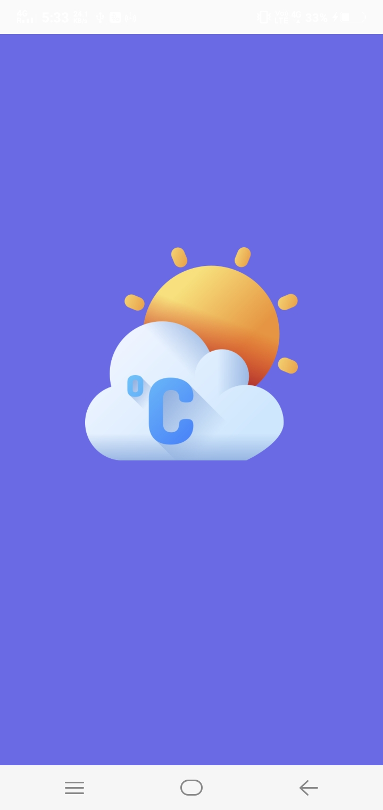
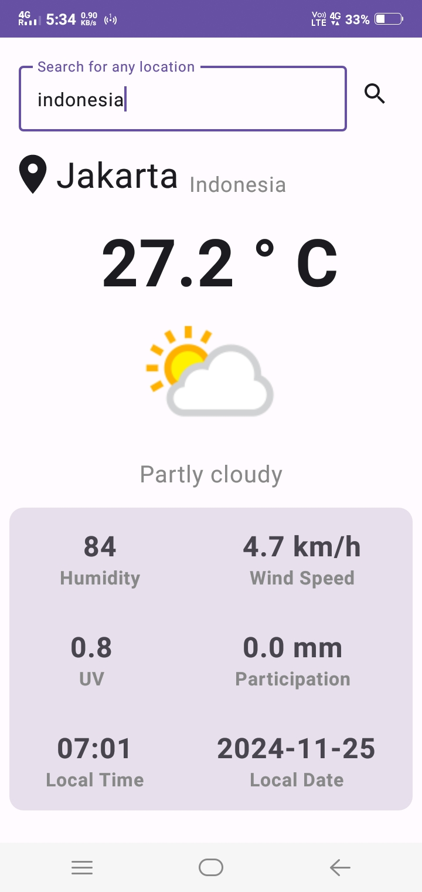
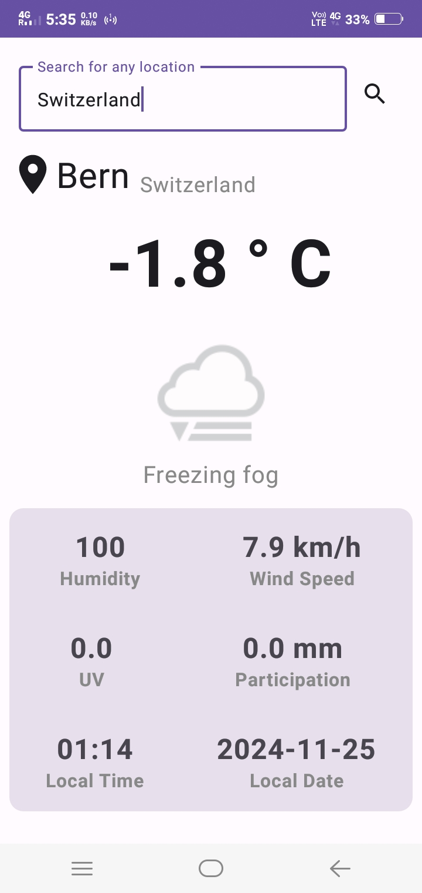

# 🌍 Climate Connect 🌤️

**Climate Connect** is an Android application that provides weather information using the **Weather API**. With an intuitive and user-friendly interface built using **Kotlin** and **Jetpack Compose**, users can check the weather for their locations and explore forecasts with ease.

Built with **Retrofit** to fetch data from the Weather API, this app offers real-time weather updates and useful features for all your weather tracking needs.

📦 **APK Download**  
[Download ClimateConnect APK](https://github.com/Vanshi17/ClimateConnect/raw/master/Screenshots/ClimateConnect.apk)

### 📸 Screenshots

        

### 🛠️ Technologies & Tools
- **Language**: Kotlin
- **UI**: Jetpack Compose
- **Networking**: Retrofit
- **API**: Weather API

### 🚀 Features
- **Search for Locations**: Find weather details for any city or place.
- **Weather Information**: View any location's current weather, temperature, and conditions.
- **Intuitive UI**: Easy-to-use and clean user interface powered by Jetpack Compose.

### 🚧 Upcoming Features:
1. **Pin Often Searched Places**: Quickly access frequently searched locations.
2. **View Search History**: See and access your past searches.
3. **7-Day Weather Forecast**: View a forecast for the next 7 days, including temperature, humidity, and conditions.

---
