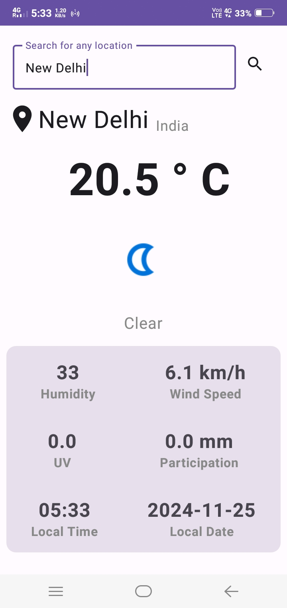
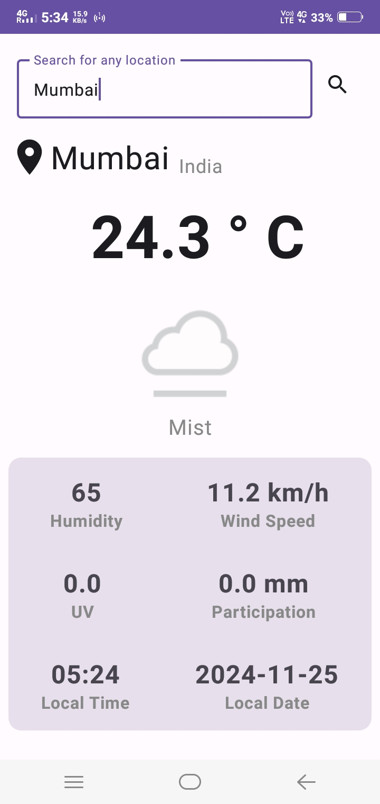

# 🌍 Climate Connect 🌤️

**Climate Connect** is an Android application that provides weather information using the **Weather API**. With an intuitive and user-friendly interface built using **Kotlin** and **Jetpack Compose**, users can check the weather for their locations and explore forecasts with ease.

Built with **Retrofit** to fetch data from the Weather API, this app offers real-time weather updates and useful features for all your weather tracking needs.

📦 **APK Download**  
[Download ClimateConnect APK](https://github.com/Vanshi17/ClimateConnect/raw/master/Screenshots/ClimateConnect.apk)

### 📸 Screenshots

        

### 🛠️ Technologies & Tools
- **Language**: Kotlin
- **UI**: Jetpack Compose
- **Networking**: Retrofit
- **API**: Weather API

### 🚀 Features
- **Search for Locations**: Find weather details for any city or place.
- **Weather Information**: View current weather, temperature, and conditions for any location.
- **Intuitive UI**: Easy-to-use and clean user interface powered by Jetpack Compose.

### 🚧 Upcoming Features:
1. **Pin Often Searched Places**: Quickly access frequently searched locations.
2. **View Search History**: See and access your past searches.
3. **7-Day Weather Forecast**: View a forecast for the next 7 days, including temperature, humidity, and conditions.

### ⚠️ Important Notice:
The weather data will be available until **7th December**. After that, the app will no longer fetch data due to the expiration of the free trial for the Weather API account. Please note that the data will no longer load after the trial period ends.

---
